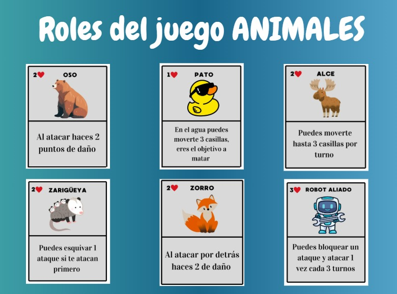
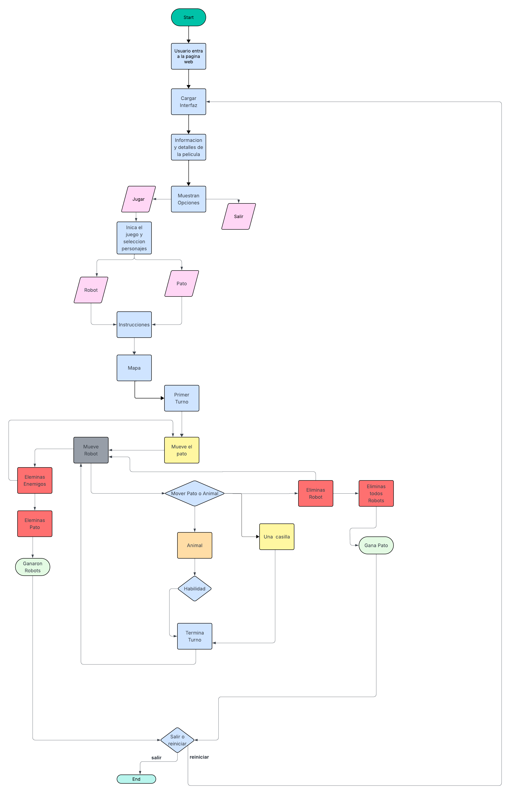

# Patotective

## Integrantes

- Saucedo Solorzano Jesus Gael
- Hernandez Barrera Diego
- Martinez Lazcano Aslan Yacid

## Informacion del juego de mesa

- Robot Salvaje
- Basada en la pelicula animada robot salvaje # Salva el Pato

## Objetivo del juego

- **Animales:** Proteger al Pato de los robots durante 20 turnos.
- **Robots:** Capturar al Pato antes de que termine ese tiempo.

## Duración

- Entre 20 y 30 minutos, dependiendo de la estrategia de los jugadores.

## Preparación

1. **Colocar el tablero:** Ubica el mapa de la isla en el centro con todos los terrenos (bosque, ríos, montañas y escondites) visibles.
2. **Seleccionar bandos y fichas:**
   - Cada jugador elige ser robot o animal y toma sus fichas.
   - Robots inician en el borde del tablero.
   - Animales se colocan cerca del centro protegiendo al Pato.
3. **Marcadores de vida:** Reparte marcadores según el personaje (robots: 3, animales: 2 o 3).
4. **Tarjetas de habilidad:** Entrega a cada jugador la tarjeta con las habilidades de su personaje.
5. **Posicionar al Pato:** El Pato comienza en una zona de agua o escondite, a elección de los animales.

## Elementos del juego

- Tablero, fichas de personaje, marcadores de vida
- Cartas de habilidad
- Dado de 6 caras
- Una ficha especial del Pato

## Turnos y acciones

Cada jugador, en su turno, puede elegir una de estas opciones:

- Mover su ficha
- Usar una habilidad especial
- Atacar a un oponente cercano

### Movimiento

- **Robots:** Hasta 2 espacios en llanos, solo 1 en bosque o montaña.
- **Animales:** Hasta 3 espacios, excepto el Zorro (hasta 4).
- **El Pato:** Solo 1 espacio, pero puede esconderse en agua o esconderse.

### Ataque

- Se puede atacar si hay un oponente adyacente.
- Lanza un dado de 6 caras:
  - 4, 5 o 6: Ataque exitoso, el adversario pierde 1 vida.

### Habilidades especiales por personaje

| Personaje    | Vida | Habilidad                                     |
| ------------ | ---- | --------------------------------------------- |
| Oso          | 2    | Al atacar hace 2 puntos de daño               |
| Pato         | 1    | Se mueve 3 casillas en agua, objetivo a matar |
| Alce         | 2    | Se mueve hasta 3 casillas por turno           |
| Zarigüeya    | 2    | Esquiva 1 ataque si es atacada primero        |
| Zorro        | 2    | Al atacar desde detrás hace 2 de daño         |
| Robot Aliado | 3    | Bloquea ataque y ataca 1 vez cada 3 turnos    |
| Robot        | 3    | En montaña solo se mueve 1 casilla            |

## Condiciones de victoria y puntuación

- **Ganan los robots:** Si capturan al Pato antes del turno 20.
  - 10 puntos por cada turno restante para cada robot que participe.
- **Ganan los animales:** Si protegen al Pato hasta el turno 20.
  - 10 puntos por cada robot eliminado.

---

**Notas:**

- El Pato no puede atacar, solo moverse o esconderse.
- Si el Pato es capturado, los animales pierden automáticamente.

## Galeria de fotos:

# Retos de implementación: De juego de mesa a juego web

## 1. Digitalización de reglas y mecánicas

- Traducir las acciones físicas (mover fichas, lanzar dados, ocultar información) a interacciones digitales precisas e intuitivas.
- Garantizar que todas las reglas se automaticen correctamente y sin ambigüedades para los usuarios.

## 2. Interfaz y experiencia de usuario (UI/UX)

- Crear una interfaz clara y atractiva que refleje el tablero, áreas y elementos del juego original.
- Diseñar controles simples para seleccionar, mover y activar habilidades de fichas.
- Ofrecer notificaciones visuales o auditivas para eventos clave (ataques, bloqueos, cambios de turno).

## 3. Sincronización y multijugador

- Programar un sistema eficiente para manejar turnos y sincronizar el estado del juego entre varios jugadores en tiempo real.
- Prevenir problemas de latencia que puedan arruinar la experiencia o crear errores de juego.
- Implementar lógica de reconexión para evitar que una desconexión afecte el desarrollo normal de la partida.

---

## Algoritmos en Lenguaje Natural

Componentes principales: tablero, fichas (animales, robots, pato), cartas/habilidades, marcadores de vida

Crear Game con id y cargar tablero con posiciones iniciales predefinidas

Cada jugador selecciona bando:

- Si humano vs humano: asignar equipos según selección.

- Si solo 1 humano: posibilidad de bots para completar.

Inicializar turno_actual = 1; elegir primer jugador que juega animales

Esperar acción válida del playerTurnId o expiración del timer:

Acciones posibles: MOVE, USE_ABILITY, ATTACK, PASS.

Al recibir acción del cliente:

- Si inválida → enviar

- Si válida → aplicar efectos (ver algoritmos específicos abajo), actualizar estado, añadir Event al log.

Si accion ejecutada con éxito, actualizar accionesRestantes (si solo 1 acción por turno, quedará 0).

Enviar STATE_UPDATE a todos los clientes con cambios (movimientos, pérdidas de vida, eliminaciones).

Ejecutar efectos pos-acción: check muertes (vida ≤ 0), aplicar puntos por eliminación si corresponde, comprobar condiciones de victoria (ver sección).

Finalizar turno

turno_actual += 1 (o calcular siguiente según orden de jugadores).

Si turno_actual > 20 y los robots no capturaron al pato → declarar victoria de animales. O si robots = 0 ganan los animales.

## Lenguaje natural

- El usuario ingresa a la página web del videojuego.

- Se carga la interfaz principal.

- Se muestran la información y detalles de la película.

- Se presentan opciones:

- Si el usuario elige "Jugar":

- Inicia el juego y selecciona el personaje (Robot o Pato).

- El juego muestra instrucciones.

- Se presenta el mapa.

- Empieza el primer turno.

- Si el personaje es Robot:

- El Robot hace su movimiento.

- Si elimina enemigos:

- Elimina Pato (si corresponde).

- Si todos los Patos fueron eliminados, los Robots ganan.

- Si el personaje es Pato:

- El Pato hace su movimiento.

- Puede mover el Pato a un animal.

- Si se mueve a un animal, puede usar una habilidad especial.

- El turno termina.

- Si se mueve a una casilla normal, el turno termina.

- Si elimina a un Robot:

- Elimina al Robot del mapa.

- Si elimina todos los Robots, el Pato gana.

- Al finalizar cada turno, se puede optar por salir o reiniciar.

- Si se sale, termina el juego.

- Si se reinicia, se vuelve a cargar la interfaz principal.

- Si el usuario elige "Salir", termina el juego.

## Diagramas de Flujo

## Prototipo en Figma

https://www.figma.com/design/iLdo7PqzoVSvcw4klDiC89/Web-Design-%7C-Website-Design-%7C-Software-House-Website-%7C-Software-Company-Website--Community-?node-id=0-1&t=zWIlJ7BZAITdQ76w-1
